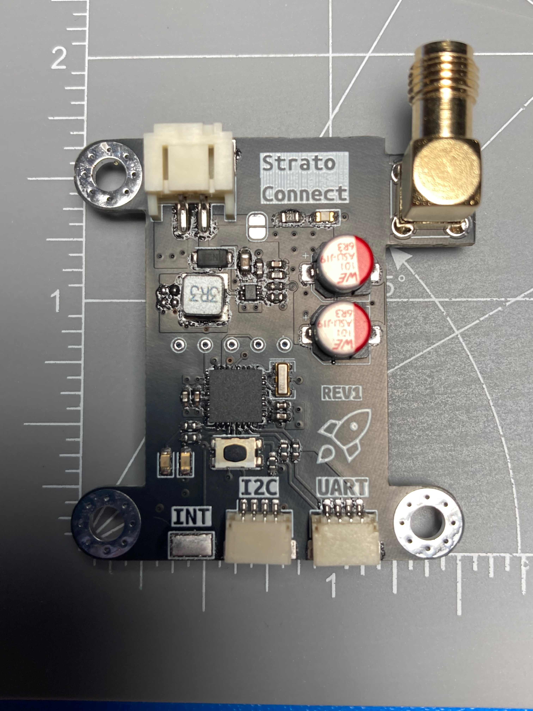

# Strato Connect

Strato Connect is an RF module used to send AX.25 formatted data with (G)FSK modulation over I2C. Connect a host MCU or computer to this module, and you can communicate with any AX.25 supported receiver up to 100 kilometers line of sight. 

# Rev 2.0 PCB Todo
1. The current boost regulator doesn't really work. We are getting voltage drops when there are current spikes. 
1. IRQ was not connected.
1. RX/TX labels are wrong for the uart port. 
1. Switch the JST connectors to be the 1.0mm pitch connector type used for QT/QWICC
1. Refactor the code to take an interface in for the I2C Controller instead of passing a function pointer

# Code
To compile and run tests use: `g++ test/test.cpp ax25/ax25.* test/ax25_test.h -lgtest -std=c++17 && ./a.out`
To compile code for arduino use: `arduino-cli compile -b MiniCore:avr:328 --library=./rf4463,./ax25 --output-dir=bin`

